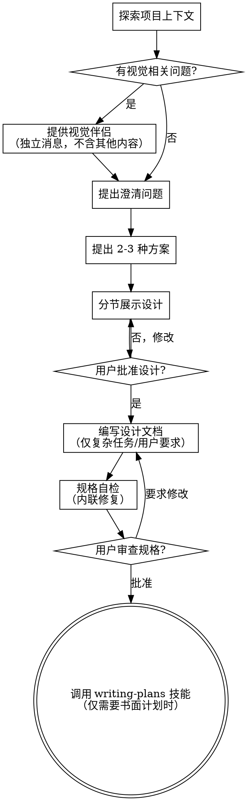

# 头脑风暴：将想法转化为设计

通过自然的协作对话，帮助将想法转化为完整的设计和规格说明。

首先了解当前项目的上下文，然后逐一提问来完善想法。一旦你理解了要构建的内容，就展示设计方案并获得用户批准。

<HARD-GATE>
在你展示设计方案并获得用户批准之前，不要调用任何实现技能、编写任何代码、搭建任何项目或采取任何实现行动。这条约束只适用于当前 skill 已被触发的任务。
</HARD-GATE>

## 深度讨论触发模式

当用户在已有目标、方案、执行计划、话题、文章、观点或材料前说出类似表达时，进入本模式：

- “在制定方案前咱们深入讨论下”
- “在执行方案前咱们深入讨论下”
- “先别急着执行”
- “我们先模拟一下”
- “先讨论清楚再做”
- “先确认规则”
- “先问我问题”
- “就这篇文章先讨论下”
- “围绕这个话题深入聊聊”
- “先别急着下结论”
- “先做论证深挖”
- “先帮我把这个观点想深”

进入本模式后，必须遵守：

1. 暂停输出正式方案、执行计划、代码修改、任务拆解、最终结论、评论、摘要或成稿。
2. 先复述当前目标、已有方案、话题、文章、观点或材料的核心理解。
3. 提取当前已经确定的规则、结论、立场或关键信息。
4. 找出仍会影响输出方向的关键不确定点。
5. 每轮最多问 3 个问题，优先问会改变产品规则、数据结构、接口设计、用户流程、实现成本、兼容性、风险控制、核心立场、论证方向、适用边界或输出目的的问题。
6. 用户回答后，先更新“已确认规则”，再判断是否还需要追问。
7. 如果某个选择会明显增加实现复杂度，主动指出成本和替代方案。
8. 如果回答消除了关键不确定点，输出“最终规则确认稿”或“最终理解确认稿”。
9. 只有用户明确回复“确认”“可以制定方案”“开始执行”“可以下结论”“可以写正文”等推进指令后，才进入正式输出阶段。

## 分类追问重点

根据讨论对象选择追问重点，不要把所有问题都套成项目管理问题：

- **项目/方案类：** 重点澄清目标用户、核心流程、产品规则、数据结构、接口边界、兼容策略、实现成本、风险和验收标准。
- **文章/材料类：** 重点澄清核心论点、证据质量、作者假设、隐含前提、反例、适用边界、用户想要的阅读目的和输出形式。需要研究深度时，进入论证深挖模式。
- **话题/观点类：** 重点澄清用户立场、争议焦点、概念定义、判断标准、可能反方、现实约束和最终要形成的结论类型。

如果用户只是想开放讨论，不要过早收束成方案；如果用户已经表达推进意图，按停止追问边界收束为确认稿。

## 论证深挖模式

当用户围绕文章、研究报告、观点、材料或复杂话题要求“深入讨论”“想深”“先别急着下结论”时，在普通澄清之外执行论证深挖。目标是提升思考质量，不是直接写成稿。

先建立一张轻量论证地图：

- **核心问题：** 这篇文章或讨论到底要回答什么问题？
- **主张：** 用户或材料当前最想表达的判断是什么？
- **证据：** 支撑主张的事实、数据、案例、经验或引用是什么？
- **推断链：** 证据如何推出主张，中间有没有跳步？
- **隐含假设：** 哪些前提没有明说，但一旦不成立，结论会动摇？
- **反方观点：** 一个聪明的反对者会怎样质疑？
- **适用边界：** 结论在哪些场景成立，在哪些场景不成立？
- **输出目的：** 最终是解释、批评、预测、建议、决策、复盘还是写作表达？

讨论时主动区分：

- **事实：** 可以被材料、数据或外部证据验证的陈述
- **推断：** 从事实推出的判断
- **假设：** 当前暂时接受但尚未验证的前提
- **价值判断：** 依赖立场、偏好或目标函数的判断
- **写作选择：** 为了表达效果而选择的结构、语气和重点

每轮追问优先选择最能提高论证质量的问题，例如：

- 如果只能保留一个核心论点，它是什么？
- 当前最薄弱的证据是哪一环？
- 反方最有力的质疑是什么？
- 这个判断在哪些条件下会失效？
- 读者读完后应该改变什么看法或行动？

停止追问时，最终理解确认稿除通用要求外，还应包含：核心问题、核心主张、关键证据、主要假设、最强反方、适用边界和建议写作方向。

## 提问呈现规则

进入深度讨论触发模式后，每一轮回复必须二选一：

1. **继续追问**
   - 回复最后必须出现独立小节：`本轮问题`
   - 问题数量为 1-3 个
   - 问题必须是明确可回答的问题，不能只用分析、建议或判断代替提问
   - 不要把问题埋在长段分析中；问题必须清晰、靠后、可直接回答

2. **停止追问**
   - 回复最后必须出现独立小节：`最终规则确认稿` 或 `最终理解确认稿`
   - 请求用户确认是否进入下一阶段

如果本轮仍需要用户输入，不能只输出“当前判断”“隐含点”“建议”而不提供清晰问题。

## 停止追问边界

进入深度讨论触发模式后，不允许无限追问。满足任一条件时，必须停止继续提问，转入“最终规则确认稿”或“最终理解确认稿”：

1. 已确认的问题足以决定方案主路径、核心结论、评论方向、摘要重点、正文立场或论证骨架。
2. 剩余问题只影响细节，不影响架构、数据结构、接口边界、核心流程、实现成本、核心论点、证据链、反方处理、适用边界或输出目的。
3. 已连续追问 3 轮，仍没有出现新的关键不确定点。
4. 用户表达“先这样”“差不多”“可以了”“继续”“开始方案”“开始执行”等推进意图。
5. 未确认事项可以用合理默认值处理，并且该默认值可以在方案中明确标注。

停止追问后，输出：

- 已确认规则/结论/立场/论证骨架
- 采用的默认假设
- 暂不处理或后续可扩展事项
- 建议进入的下一阶段：方案、执行、结论、评论、摘要、提纲、正文或研究报告
- 仍需用户最终确认的一句话

不要继续追加新问题，除非发现会导致方案、结论或输出方向错误的重大缺口。

## 反模式："明明需要设计，却跳过设计"

不是每个改动都要进入完整的头脑风暴流程。单文件修复、轻量规则更新、文档措辞调整、小范围配置修改，通常直接执行或给出简短内联方案即可。只有当需求包含明显的设计不确定性、方案权衡、范围拆解或跨组件影响时，才应进入该流程。

## 检查清单

你必须为以下每个条目创建任务，并按顺序完成：

1. **探索项目上下文** — 检查文件、文档；仅在已验证可用时查看最近的 commit
2. **提供视觉伴侣**（如果主题涉及视觉问题）— 这是一条独立的消息，不要与澄清问题合并。参见下方的"视觉伴侣"部分。
3. **提出澄清问题** — 每次一个，了解目的/约束/成功标准
4. **提出 2-3 种方案** — 附带权衡分析和你的推荐
5. **展示设计** — 按复杂度分节展示，每节展示后获得用户批准
6. **编写设计文档** — 仅在复杂任务、需要跨轮次共享或用户明确要求时，保存到 `docs/superpowers/specs/YYYY-MM-DD-<topic>-design.md`
7. **规格自检** — 快速内联检查占位符、矛盾、模糊性、范围（详见下方）
8. **用户审查书面规格** — 如果已生成规格文件，在继续之前请用户审查
9. **过渡到实现** — 仅在后续实现复杂且需要书面执行计划时，调用 `writing-plans`

## 流程图

**若需要正式实现计划，终止状态是调用 writing-plans。** 不要在 brainstorming 内直接切入实现；是否继续到 `writing-plans` 取决于任务复杂度，而不是默认必选。

## 流程详述

**理解想法：**

- 首先查看当前项目状态（文件、文档；仅在已验证 git 可用时查看最近的 commit）
- 在提出详细问题之前，先评估范围：如果需求描述了多个独立子系统（例如"构建一个包含聊天、文件存储、计费和分析的平台"），立即指出这一点。不要花时间用问题去细化一个需要先拆分的项目。
- 如果项目规模过大，单个规格说明无法覆盖，帮助用户分解为子项目：有哪些独立的部分，它们之间有什么关系，应该按什么顺序构建？然后通过正常的设计流程进行第一个子项目的头脑风暴。每个子项目都有自己的规格 → 计划 → 实现周期。
- 对于范围适当的项目，每次提一个问题来完善想法
- 尽量使用选择题，开放式问题也可以
- 每条消息只提一个问题——如果一个主题需要更多探索，拆分成多个问题
- 重点理解：目的、约束、成功标准

**探索方案：**

- 提出 2-3 种不同的方案及其权衡
- 以对话的方式展示选项，附上你的推荐和理由
- 先展示你推荐的方案并解释原因

**展示设计：**

- 一旦你认为理解了要构建的内容，就展示设计
- 每个部分的篇幅与其复杂度匹配：简单的几句话，复杂的最多 200-300 字
- 每个部分展示后询问是否正确
- 涵盖：架构、组件、数据流、错误处理、测试
- 随时准备回头澄清不明确的地方

**面向隔离和清晰的设计：**

- 将系统拆分为更小的单元，每个单元有一个明确的职责，通过定义良好的接口通信，可以独立理解和测试
- 对于每个单元，你应该能回答：它做什么，如何使用，它依赖什么？
- 别人能否不看内部实现就理解一个单元的功能？你能否在不影响调用者的情况下修改内部实现？如果不能，边界需要调整。
- 更小、边界清晰的单元也更便于你工作——你对能一次放入上下文的代码推理得更好，文件越专注你的编辑越可靠。当文件变大时，这通常意味着它承担了过多职责。

**在现有代码库中工作：**

- 在提出更改之前先探索现有结构。遵循现有模式。
- 如果现有代码存在影响当前工作的问题（例如文件过大、边界不清、职责纠缠），在设计中包含有针对性的改进——就像一个优秀的开发者在工作中改进经手的代码一样。
- 不要提议无关的重构。专注于服务当前目标的事情。

## 设计之后

**文档：**

- 将验证通过的设计（规格说明）写入 `docs/superpowers/specs/YYYY-MM-DD-<topic>-design.md`，仅在复杂任务、需要跨轮次共享或用户明确要求时执行
  - （用户对规格位置的偏好优先于此默认值；小改动使用内联总结即可）
- 如果可用，使用 elements-of-style:writing-clearly-and-concisely 技能
- 不要默认要求 commit 到 git；只有在 git 能力已验证且用户明确需要时才这样做

**规格自检：**
编写规格文档后，以全新的视角审视它：

1. **占位符扫描：** 有没有"待定"、"TODO"、未完成的章节或模糊的需求？修复它们。
2. **内部一致性：** 各章节之间有矛盾吗？架构和功能描述匹配吗？
3. **范围检查：** 这是否聚焦到可以用一个实现计划覆盖，还是需要进一步拆分？
4. **模糊性检查：** 有没有需求可以被两种方式理解？如果有，选择一种并明确写出来。

发现问题就直接内联修复。无需重新审查——修好继续推进。

**用户审查关卡：**
如果已生成书面规格，规格自检完成后请用户在继续之前审查：

> "规格已整理到 `<path>`。请审查一下，如果在我们开始编写实现计划之前你想做任何修改，请告诉我。"

等待用户回复。如果他们要求修改，做出修改并重新运行规格自检。只有在用户批准后才继续。

**实现：**

- 当任务复杂且需要书面执行计划时，调用 `writing-plans` 技能创建详细实现计划
- 如果只是小范围改动，给出简短内联计划后即可继续，不必强制进入 `writing-plans`

## 核心原则

- **每次一个问题** — 不要同时抛出多个问题
- **优先选择题** — 在可能的情况下比开放式问题更容易回答
- **严格遵循 YAGNI** — 从所有设计中移除不必要的功能
- **探索替代方案** — 在做决定之前始终提出 2-3 种方案
- **增量验证** — 展示设计，获得批准后再继续
- **保持灵活** — 有不明确的地方就回头澄清

## 视觉伴侣

一个基于浏览器的伴侣工具，用于在头脑风暴过程中展示原型、图表和视觉选项。它是一个工具——不是一种模式。接受伴侣意味着它可用于适合视觉呈现的问题；并不意味着每个问题都要通过浏览器。

**提供伴侣：** 当你预计后续问题会涉及视觉内容（原型、布局、图表）时，提供一次以获得同意：
> "我们接下来讨论的一些内容，如果能在浏览器中展示给你看可能会更直观。我可以在讨论过程中为你制作原型、图表、对比图和其他视觉材料。这个功能还比较新，可能会消耗较多 token。要试试吗？（需要打开一个本地 URL）"

**此提议必须是一条独立的消息。** 不要将它与澄清问题、上下文摘要或任何其他内容合并。消息中应该只包含上述提议，没有其他内容。等待用户回复后再继续。如果他们拒绝，继续纯文本的头脑风暴。

**逐问题决策：** 即使用户接受了，也要对每个问题单独决定是使用浏览器还是终端。判断标准：**用户看到它是否比读到它更容易理解？**

- **使用浏览器** 展示本身就是视觉的内容——原型、线框图、布局对比、架构图、并排视觉设计
- **使用终端** 展示文本内容——需求问题、概念选择、权衡列表、A/B/C/D 文字选项、范围决策

关于 UI 主题的问题不一定是视觉问题。"在这个上下文中个性化是什么意思？"是一个概念问题——使用终端。"哪种向导布局更好？"是一个视觉问题——使用浏览器。

如果他们同意使用伴侣，在继续之前阅读详细指南：
`skills/brainstorming/visual-companion.md`

