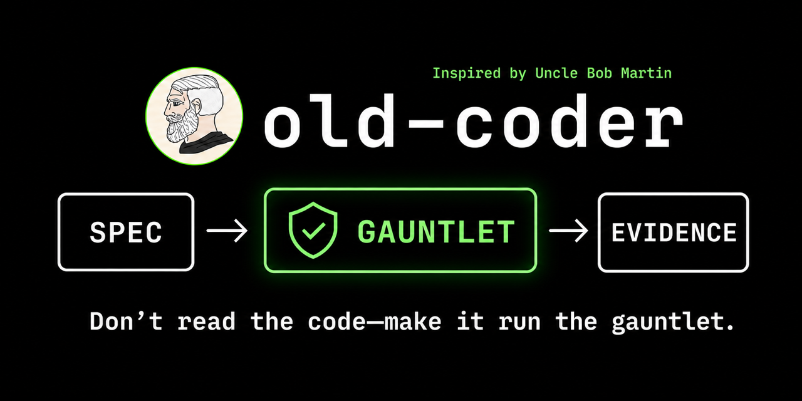
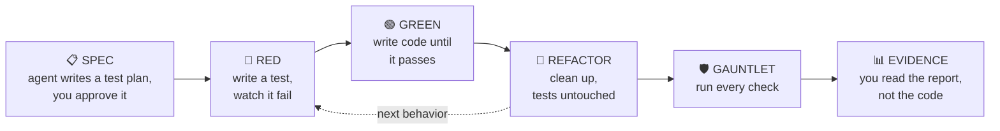

<p align="center">
  
</p>

# Old Coder skill（老码农 skill）

*[中文说明 →](README-zh.md)*

**An old coder's strategy for the agent era: don't read the code — make it run the gauntlet.**

A skill that makes coding agents **prove their work**. Instead of you reading every line the agent writes, the agent must push its code through a gauntlet of checks — and hand you a test plan before coding and an evidence report after. You review those two documents, not the code.

It's plain markdown, so it works with any coding agent that follows instructions: Claude Code, Codex CLI, Cursor, Aider, or your own agent loop.

## Installation

```sh
npx skills add https://github.com/amazingang/old-coder
```

Or manually:

- **Claude Code** — copy the skill into a skills folder, then invoke `/old-coder` or let it trigger on "prove it works"-style requests:
  ```sh
  cp -r skills/old-coder ~/.claude/skills/    # or <project>/.claude/skills/
  ```
- **Other agents** — add `skills/old-coder/SKILL.md` to your `AGENTS.md`, rules file, or system prompt, and keep `references/gauntlet.md` alongside it.

## The idea

From Uncle Bob (Robert C. Martin), on working with coding agents ([original tweet](https://x.com/unclebobmartin/status/2080257779395154409)):

> My current strategy is to not read any of the code written by my agents. That’s the only way I can take advantage of their productivity. What I do instead is to surround the agents with extreme constraints. Unit tests, gherkin tests, QA procedures, quality metrics, mutation testing, test coverage, and a plethora of others. In the end, I have very high confidence in the code they produce because they’ve had to run the gauntlet of all of my constraints and tests.

If you're not going to read the code, the things you *do* read have to carry the trust instead.

## How it works



You read two documents:

- **SPEC** (before any code) — concrete examples of what the code must and must not do, plus which tools the agent wants to install. Approving it is the single yes/no you give.
- **EVIDENCE** (after the code) — real numbers from one final fresh run, rerunnable yourself with a single command.

The gauntlet in between:

| Check | The question it answers |
|---|---|
| Full test suite | Did anything break? |
| Types + lint + complexity | Any obvious mistakes? Any unreadable tangles? |
| Changed-line coverage | Is every new line actually exercised by a test? |
| Mutation testing | Plant bugs on purpose — do the tests catch them? |
| Property-based tests | Do the rules survive hundreds of random inputs? |
| Real execution | Does it actually run, outside the test harness? |
| Supply chain & secrets | Did the agent quietly pull in risky packages, or leak a key? |
| Suite health | Are the tests themselves stable, in any order? |

Plus a menu of domain-specific layers — concurrency, UI checks, API compatibility, performance, observability — picked per task from a risk model (see `references/gauntlet.md`).

Effort scales with risk: a typo fix runs a couple of checks; anything touching money, logins, data, or concurrency runs everything — plus the agent attacks its own code with hostile inputs first.

## Keeping the agent honest

The agent grades its own homework, so the rules are strict: never weaken a test to make it pass; never report a check that didn't run; anything unverified is labeled `unverified`, never `pass`; if no human approved the spec, the report must say so and claim less confidence.

And one limit stated plainly: the gauntlet proves the code meets the spec — it cannot prove the spec covers everything that matters. That's why the spec goes to you.

## What's in the repo

```
skills/old-coder/         the skill (SKILL.md + references/gauntlet.md)
demo-rate-limiter/        a rate limiter built end-to-end under the skill
```

The demo's `evidence.md` is the point of the exercise: 17 tests, 100% branch coverage of the code, 8/8 planted bugs caught — and the process found a real bug the tests had missed (a `NaN` time window slipping through validation). Rerun the whole report:

```sh
cd demo-rate-limiter
python3 -m venv .venv && .venv/bin/pip install -r requirements-dev.txt -e .
./tools/gauntlet.sh
```

## License

MIT
